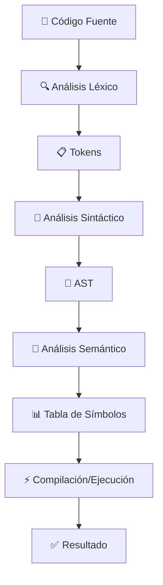

<div align="center">

# 🚀 Compilador- Proyecto 

### *Un compilador completo y moderno para múltiples lenguajes de programación*

[](https://nextjs.org/)
[](https://golang.org/)
[](https://www.typescriptlang.org/)
[](https://tailwindcss.com/)

**Universidad Mariano Gálvez de Guatemala** • **Campus Jutiapa** • **Ingeniería en Sistemas**


</div>

## ✨ **¿Qué es este proyecto?**

Un **simulador de compilador completo** que no solo analiza código, sino que **compila y ejecuta** programas reales en múltiples lenguajes. Combina teoría de compiladores con implementación práctica usando tecnologías modernas.


## 🏗️ **Arquitectura del Sistema**

<table>
<tr>
<td width="50%">

### 🖥️ **Backend Potente**
```go
🔧 Go 1.21+ con Gorilla Mux
🌐 API REST completa
🔒 Sandboxing de seguridad
⚡ Compilación en tiempo real
🛡️ CORS configurado
```

</td>
<td width="50%">

### 🎨 **Frontend Moderno**
```typescript
⚛️ Next.js 14 + TypeScript
🎨 Tailwind CSS + shadcn/ui
📱 Diseño responsivo
📊 Visualización en tiempo real
🔄 Hot reload
```

</td>
</tr>
</table>

## 🌍 **Lenguajes Soportados**

<div align="center">

| Lenguaje | Estado | Funcionalidad | Tecnología |
|:--------:|:------:|:------------:|:----------:|
|  | 🟢 **Completo** | Compilación Real | `g++` |
|  | 🟢 **Completo** | Ejecución Real | `python3` |
|  | 🟢 **Completo** | Ejecución Real | `node.js` |
|  | 🟢 **Completo** | Validación | Análisis DOM |
|  | 🟢 **Completo** | T-SQL/PL-SQL | Simulación |
|  | 🟡 **Opcional** | Compilación | Free Pascal |

</div>

## 🚀 **Inicio Rápido**

### 🔧 **Instalación Automática**

```bash
# 1️⃣ Clona el repositorio
git clone <repository-url>
cd Compiladores

# 2️⃣ Ejecuta el entorno completo
./start-dev.sh

# 3️⃣ ¡Listo! Abre tu navegador en:
# 🌐 Frontend: http://localhost:3000
# 🔌 Backend:  http://localhost:8080
```


<details>

## 🎯 **Características Principales**

<div align="center">

### 🔬 **Análisis Completo**

</div>


## 🌐 **API REST**

### **Endpoints Principales**

<details>
<summary>📡 <strong>Ver documentación completa de la API</strong></summary>

#### **Análisis de Código**
```http
POST /api/v1/analyze
Content-Type: application/json

{
  "code": "print('Hello World')",
  "language": "python"
}
```

#### **Estado del Servidor**
```http
GET /api/v1/health
```

#### **Configuración**
```http
GET /api/v1/config
```

</details>

## 📚 **Ejemplos de Código**

<details>
<summary>🐍 <strong>Python - Ejecución Real</strong></summary>

```python
    def fibonacci(n):
        if n <= 1:
            return n
        return fibonacci(n-1) + fibonacci(n-2)

    # Calcular los primeros 10 números de Fibonacci
    for i in range(10):
        print(f"F({i}) = {fibonacci(i)}")
```

</details>

<details>
<summary>🔨 <strong>C++ - Compilación Real</strong></summary>

```cpp
#include <iostream>
#include <vector>
#include <algorithm>

int main() {
    std::vector<int> numeros = {64, 34, 25, 12, 22, 11, 90};
    
    std::sort(numeros.begin(), numeros.end());
    
    std::cout << "Números ordenados: ";
    for(int num : numeros) {
        std::cout << num << " ";
    }
    
    return 0;
}
```
```html
<html>
    <body>
        <h1>Hello World</h1>
    </body>
</html>
```
</details>

<details>
<summary>📦 <strong>JavaScript - Node.js</strong></summary>

```javascript
function fibonacci(n) {
    if (n <= 1) return n;
    return fibonacci(n-1) + fibonacci(n-2);
}

console.log(fibonacci(10));
```

</details>

```sql
CREATE TABLE users (
    id INT PRIMARY KEY,
    name VARCHAR(255),
    email VARCHAR(255)
);

INSERT INTO users (id, name, email) VALUES (1, 'John Doe', 'john@example.com');
```


## 🛠️ **Estructura del Proyecto**

```
Compiladores/
├── 🎨 app/                    # Frontend Next.js
├── 🔧 compiler-backend/       # Backend Go
├── 🧩 components/            # Componentes UI
├── 🎣 hooks/                 # React Hooks
├── 📚 lib/                   # Utilidades
├── 🌍 public/                # Archivos públicos
├── 🚀 start-dev.sh          # Script de inicio
└── 📋 package.json          # Dependencias
```


<div align="center">

### 🎓 **Proyecto Académico - Universidad Mariano Gálvez**


</div>


