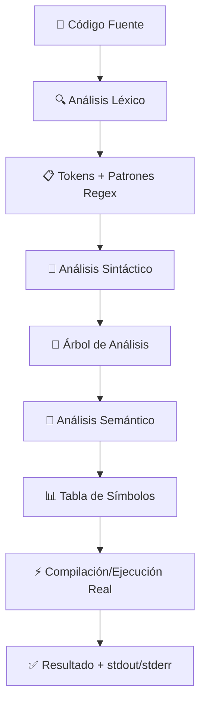

<div align="center">

# 🚀 Compilador- Proyecto 

### *Un compilador completo y moderno para múltiples lenguajes de programación*

[](https://nextjs.org/)
[](https://golang.org/)
[](https://www.typescriptlang.org/)
[](https://tailwindcss.com/)

**Universidad Mariano Gálvez de Guatemala** • **Campus Jutiapa** • **Ingeniería en Sistemas**


</div>

## ✨ **¿Qué es este proyecto?**

Un **compilador completo y funcional** implementado en Go que no solo analiza código, sino que **compila y ejecuta** programas reales en múltiples lenguajes. Combina teoría de compiladores con implementación práctica usando tecnologías modernas.


## 🏗️ **Arquitectura del Sistema**

<table>
<tr>
<td width="50%">

### 🔧 **Backend Potente (Go)**
```go
🦫 Go 1.21+ con net/http
🌐 API REST nativa
🔒 Ejecución en sandbox
⚡ Compilación real
🛡️ CORS configurado
🔥 Análisis léxico, sintáctico y semántico
```

</td>
<td width="50%">

### 🎨 **Frontend Moderno**
```typescript
⚛️ Next.js 15 + TypeScript
🎨 Tailwind CSS + shadcn/ui
📱 Diseño responsivo
📊 Visualización en tiempo real
🔄 Hot reload con Turbopack
🎯 Editor Monaco integrado
```

</td>
</tr>
</table>

## 🌍 **Lenguajes Soportados - Ejecución Real**

<div align="center">

| Lenguaje | Estado | Funcionalidad | Tecnología | Backend |
|:--------:|:------:|:------------:|:----------:|:--------:|
|  | 🟢 **Completo** | Compilación + Ejecución | `g++ -std=c++17` | ✅ Go |
|  | 🟢 **Completo** | Ejecución Directa | `python3` | ✅ Go |
|  | 🟢 **Completo** | Ejecución Node.js | `node` | ✅ Go |

</div>

## 🚀 **Inicio Rápido**

### 🔧 **Instalación y Ejecución**

```bash
# 1️⃣ Clona el repositorio
git clone <repository-url>
cd Compiladores

# 2️⃣ Instala dependencias del sistema (macOS)
brew install go node gcc python3

# 3️⃣ Ejecuta el entorno completo (Backend + Frontend)
./start-dev.sh

# 4️⃣ ¡Listo! Abre tu navegador en:
# 🌐 Frontend: http://localhost:3000
# 🔌 Backend:  http://localhost:8080/api/v1/health
```

### 🪟 **Solo Backend (Desarrollo)**

```bash
# Ejecutar solo el compilador backend
./start-backend.sh

# O manualmente:
cd compiler-backend
go mod tidy
go run main.go compiler.go
```

### 🧪 **Prueba Rápida del Backend**

```bash
# Probar health check
curl http://localhost:8080/api/v1/health

# Probar análisis de código C++
curl -X POST http://localhost:8080/api/v1/analyze \
  -H "Content-Type: application/json" \
  -d '{"code": "#include <iostream>\nint main() { std::cout << \"Hello!\"; return 0; }", "language": "cpp"}'
```

## 🎯 **Características del Compilador**

<div align="center">

### 🔬 **Análisis Completo en Go**

</div>



### 🔥 **Funcionalidades Avanzadas**

- **✅ Análisis Léxico:** Tokenización completa con regex patterns por lenguaje
- **✅ Análisis Sintáctico:** Construcción de árboles de análisis
- **✅ Análisis Semántico:** Tabla de símbolos y verificación de tipos
- **✅ Ejecución Real:** Compilación y ejecución en sandbox con timeout
- **✅ Detección Automática:** Detecta el lenguaje automáticamente
- **✅ Manejo de Errores:** Reportes detallados con ubicación
- **✅ API REST:** Integración perfecta con el frontend

## 🌐 **API REST del Compilador**

### **Endpoints Principales**

<details>
<summary>📡 <strong>Ver documentación completa de la API</strong></summary>

#### **🔍 Análisis y Compilación**
```http
POST /api/v1/analyze
Content-Type: application/json

{
  "code": "#include <iostream>\nint main() { std::cout << \"Hello\"; return 0; }",
  "language": "cpp"
}
```

**Respuesta:**
```json
{
  "language": "cpp",
  "tokens": [...],
  "parseTree": [...],
  "symbolTable": [...],
  "errors": [],
  "canExecute": true,
  "executionResult": {
    "success": true,
    "output": "Hello"
  },
  "analysisPhases": {
    "lexical": { "completed": true, "tokensFound": 15 },
    "syntax": { "completed": true, "nodesGenerated": 8 },
    "semantic": { "completed": true, "symbolsFound": 3 }
  },
  "processingTime": "245.5ms"
}
```

#### **❤️ Estado del Servidor**
```http
GET /api/v1/health

Response: { "status": "ok", "service": "Compilador Go Backend" }
```

</details>

## 📚 **Ejemplos de Código - Ejecución Real**

<details>
<summary>🔨 <strong>C++ - Compilación y Ejecución Real</strong></summary>

```cpp
#include <iostream>
#include <vector>
#include <algorithm>

int main() {
    std::vector<int> numeros = {64, 34, 25, 12, 22, 11, 90};
    
    // Ordenar usando STL
    std::sort(numeros.begin(), numeros.end());
    
    std::cout << "Números ordenados: ";
    for(int num : numeros) {
        std::cout << num << " ";
    }
    std::cout << std::endl;
    
    return 0;
}
```

**🎯 Resultado:** Compilado con `g++ -std=c++17` y ejecutado en sandbox

</details>

<details>
<summary>🐍 <strong>Python - Ejecución Directa</strong></summary>

```python
def fibonacci(n):
    if n <= 1:
        return n
    return fibonacci(n-1) + fibonacci(n-2)

# Calcular Fibonacci recursivo
for i in range(10):
    result = fibonacci(i)
    print(f"F({i}) = {result}")

# Análisis de complejidad
import time
start = time.time()
fibonacci(30)
end = time.time()
print(f"Tiempo: {end - start:.4f}s")
```

**🎯 Resultado:** Ejecutado con `python3` con timeout de 4 segundos

</details>

<details>
<summary>📦 <strong>JavaScript - Node.js Real</strong></summary>

```javascript
// Algoritmo de ordenamiento burbuja
function bubbleSort(arr) {
    const n = arr.length;
    for (let i = 0; i < n - 1; i++) {
        for (let j = 0; j < n - i - 1; j++) {
            if (arr[j] > arr[j + 1]) {
                [arr[j], arr[j + 1]] = [arr[j + 1], arr[j]];
            }
        }
    }
    return arr;
}

const numeros = [64, 34, 25, 12, 22, 11, 90];
console.log("Array original:", numeros);
console.log("Array ordenado:", bubbleSort([...numeros]));

// Medir rendimiento
console.time("Bubble Sort");
bubbleSort(new Array(1000).fill(0).map(() => Math.random()));
console.timeEnd("Bubble Sort");
```

**🎯 Resultado:** Ejecutado con `node` en sandbox

</details>

## 🛠️ **Tecnologías Utilizadas**

### Backend (Compilador)
- **Go 1.21+** - Lenguaje principal del compilador
- **net/http** - Servidor HTTP nativo
- **regexp** - Análisis léxico con expresiones regulares
- **os/exec** - Ejecución de compiladores externos
- **context** - Timeouts y control de ejecución
- **github.com/rs/cors** - Manejo de CORS

### Frontend
- **Next.js 15** - Framework React con Turbopack
- **TypeScript** - Tipado estático
- **Tailwind CSS 4** - Estilos utilitarios
- **shadcn/ui** - Componentes de UI
- **Monaco Editor** - Editor de código
- **React Query** - Gestión de estado

### Herramientas de Desarrollo
- **g++** - Compilador C++17
- **Node.js** - Runtime JavaScript
- **Python 3.8+** - Intérprete Python

## 📋 **Requisitos del Sistema**

```bash
# Verificar dependencias (automático en start-dev.sh)
go version        # Go 1.21+
node --version    # Node.js 18+
g++ --version     # GCC con soporte C++17
python3 --version # Python 3.8+
```

## 🔒 **Seguridad y Sandbox**

- **⏱️ Timeout:** 4 segundos máximo por ejecución
- **🔒 Archivos Temporales:** Creación y limpieza automática
- **🛡️ Contexto Limitado:** Ejecución con `context.WithTimeout`
- **🚫 Prevención de Loops Infinitos:** Control de tiempo de ejecución
- **📁 Directorio Temporal:** Aislamiento de archivos

## 🎓 **Información Académica**

**Curso:** Compiladores  
**Universidad:** Mariano Gálvez de Guatemala  
**Campus:** Jutiapa  
**Carrera:** Ingeniería en Sistemas  
**Tecnología Principal:** Go + Next.js  

---

<div align="center">

### 🤝 **Contribuciones**

¿Quieres agregar más lenguajes o mejorar el compilador? ¡Las contribuciones son bienvenidas!

**Hecho con ❤️ y mucho ☕ en Guatemala**

</div>
